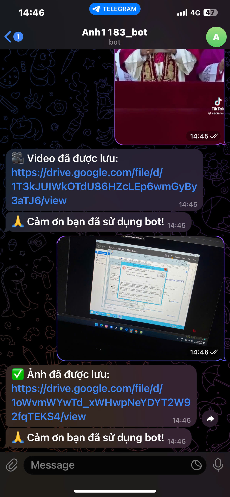
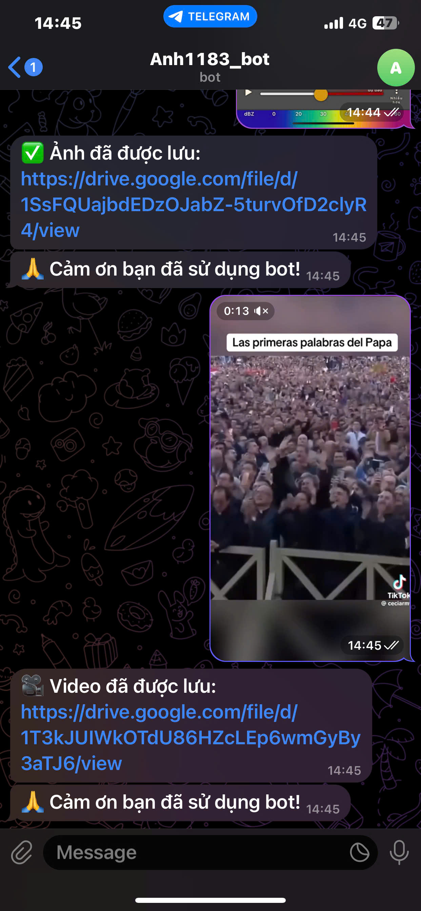

# 📸 Telegram to Google Drive Bot

Bot này cho phép bạn gửi ảnh qua Telegram và tự động lưu ảnh lên Google Drive, được sắp xếp theo ngày (định dạng `YYYY-MM-DD`). Ảnh **không lưu tạm trên ổ đĩa máy tính**.

---

## ✅ Tính năng nổi bật

- Tự động nhận ảnh từ Telegram.
- Tạo thư mục theo ngày trên Google Drive.
- Upload ảnh trực tiếp mà không lưu tạm trên máy.
- Gửi lại liên kết chia sẻ ảnh cho người dùng.

---

## 🛠️ Yêu cầu hệ thống

- Python 3.8 trở lên  
- Tài khoản Google Drive  
- Bot Telegram + Token truy cập  
- File `credentials.json` từ Google API Console  

---

## 📦 Hướng dẫn cài đặt

### 1. Tạo thư mục và môi trường ảo
```bash
mkdir telegram-drive-bot
cd telegram-drive-bot
python -m venv venv

# Kích hoạt môi trường:
# Trên Linux/macOS:
source venv/bin/activate
# Trên Windows:
venv\Scripts\activate
```

### 2. Cài đặt thư viện phụ thuộc
```bash
pip install -r requirements.txt
```

---

## 🤖 Tạo Bot Telegram

1. Mở Telegram và truy cập [@BotFather](https://t.me/BotFather)  
2. Gõ `/newbot` và làm theo hướng dẫn để tạo bot mới  
3. BotFather sẽ trả lại **Token truy cập**, lưu lại để cấu hình trong `bot.py`

---

## 🔐 Tạo Google OAuth Credentials

1. Truy cập [Google Cloud Console](https://console.cloud.google.com/)  
2. Tạo Project mới → Vào **API & Services → Enable APIs & Services**  
3. Tìm và bật **Google Drive API**  
4. Vào **Credentials → Create Credentials → OAuth Client ID**
   - **Application type**: Chọn "Desktop App"
5. Tải về file **`credentials.json`**  
6. Đặt file này vào thư mục gốc của dự án

---

## 🚀 Chạy bot lần đầu
```bash
python bot.py
```

- Lần đầu chạy, trình duyệt sẽ mở để xác thực tài khoản Google.
- Sau khi xác thực xong, file `token.json` sẽ được tạo tự động để lưu thông tin truy cập.

👉 **Lưu ý:**  
Nếu bạn **chạy cục bộ (local)** mà không deploy bot, hãy sửa dòng trong `drive_uploader.py`:
```python
creds = flow.run_console()
```
thành:
```python
creds = flow.run_local_server(port=0)
```
Điều này giúp xác thực dễ dàng hơn qua trình duyệt.

---

## 📁 Cấu trúc thư mục dự án

```
telegram-drive-bot/
├── bot.py              # Mã điều khiển Telegram Bot
├── drive_uploader.py   # Xử lý upload ảnh lên Google Drive
├── credentials.json    # OAuth credentials từ Google (tự tải về)
├── token.json          # Token xác thực Google (tạo sau lần đầu chạy)
├── requirements.txt    # Danh sách các thư viện cần cài
└── README.md           # Tài liệu hướng dẫn sử dụng
```

---

## ⚠️ Cảnh báo bảo mật

- **Không** đẩy file `credentials.json` hoặc `token.json` lên GitHub hoặc bất kỳ kho lưu trữ công khai nào.
- Nếu gặp lỗi **WinError 32**, có thể do ảnh đang bị mở bởi ứng dụng khác – hãy đóng ảnh trước khi gửi.
- Đảm bảo bot có quyền truy cập Google Drive qua tài khoản bạn đã xác thực.

---

## 🧩 Kế hoạch phát triển

- ✅ Hỗ trợ thêm **video**, **PDF**
- ✅ Giới hạn quyền gửi ảnh (chỉ cho **admin**)
- ✅ Xây dựng **dashboard web** quản lý ảnh/video

---

## 🖼️ Giao diện mẫu

| Lưu ảnh            | Lưu video           |
|--------------------|---------------------|
|  |  |

---

## 📬 Liên hệ

Nếu bạn cần hỗ trợ thêm, hãy tạo issue trên GitHub repo của dự án.
